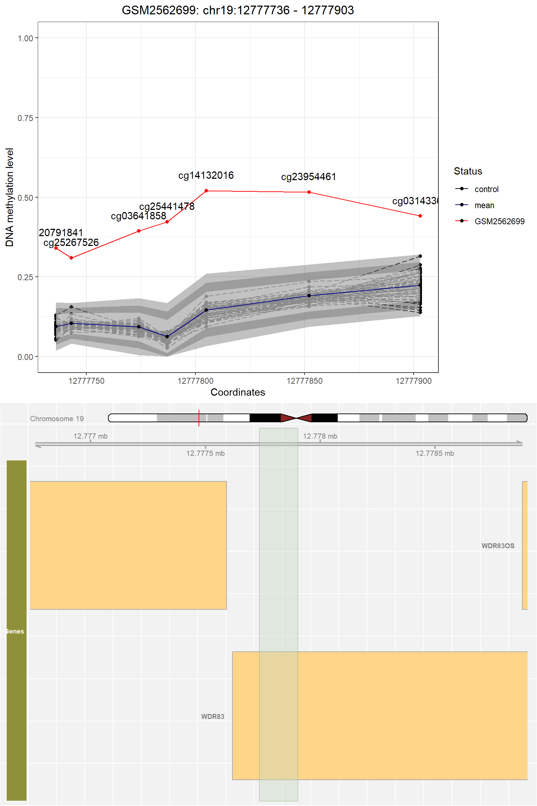
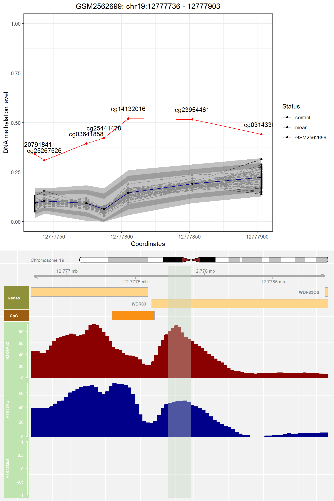

```{r setup, include=FALSE}
knitr::opts_chunk$set(comment="", 
                      warning = FALSE, 
                      message = FALSE,
                      cache = FALSE)
```


# Introduction

## Background

Epimutations are rare alterations in the methylation pattern at specific loci.
Have been demonstrated that epimutations could be the causative factor of 
some genetic diseases. 
For example, epimutations can lead to cancers, 
such as Lynch syndrome, rare diseases such as Prader-Willi syndrome, 
and are associated with common disorders, such as autism. 
Nonetheless, no standard methods are available to detect and quantify 
these alterations. Two methods for epimutations detection on methylation 
microarray data have been reported: 
(1) based on identifying CpGs with outlier values 
and then cluster them in epimutations [@barbosa2018identification]; 
(2) define candidate regions with bumphunter and test their statistical 
significance with a MANOVA [@aref2019]. 
However, the implementation of these methods is not publicly available, 
and these approaches have not been compared.    

We have developed `epimutacions` R/Bioconductor package. 
We have implemented those two methods 
(called `quantile` and `manova`, respectively). 
We implemented four additional approaches, 
using a different distribution to detect CpG outliers (`beta`), 
or a different model to 
assess region significance (`mlm`, `mahdist`, and `iForest`).


The package `epimutacions` provides tools to  raw DNA methylation microarray 
intensities normalization and epimutations identification, 
visualization and annotation.  
The full `epimutacions ` user´s guide is available in this vignette.  
The main function to estimate the epimutations is called `epimutations()`. 

The name of the package is `epimutacions` 
(pronounced `ɛ pi mu ta 'sj ons`) which means epimutations in Catalan, 
a language from the northeast of Spain.

## Methodology

The `epimutacions` package computes a genome-wide DNA methylation analysis
to identify the epimutations to be considered as biomarkers 
for case samples with a suspected genetic disease. 
The function  `epimutations()` infers epimutations on a case-control design. 
It compares a case sample against a reference panel (healthy individuals).
The package  also includes leave-one-out approach 
(`epimutations_one_leave_out()`). 
It compares individual methylation profiles of a single sample 
(regardless if they are cases or controls) against all 
other samples from the same cohort. 

The `epimutacions` package includes 6 outlier detection approaches 
(figure \@ref(fig:implementation)): 
(1) Multivariate Analysis of variance (`manova`), 
(2) Multivariate Linear Model (`mlm`), (3) isolation forest (`iForest`), 
(4) robust mahalanobis distance  (`mahdist`) (5) `quantile` and (6) `beta`.

The approaches `manova`, `mlm`, `iForest` and  `mahdist` 
define the candidate regions (differentially methylated regions (DMRs)) 
using bumphunter method [@jaffe2012bump]. 
Then, those DMRs are tested to identify regions 
with CpGs being outliers when comparing with the reference panel. 
`quantile` uses the sliding window approach to 
individually compare the methylation value  in each proband 
against the reference panel and then cluster them in epimutations.  
`Beta` utilizes beta distribution to identify outlier CpGs. 

We have defined an epimutation as a consecutive 
window of a minimum of 3 outliers CpGs with a maximum 
distance of 1kb between them [@barbosa2018identification].

```{r implementation, echo=FALSE, fig.cap= "Implementation of each outlier detection method", out.width = '90%', fig.align='center'}
knitr::include_graphics("fig/implementation.png")
```


# Setup

## Installing the packages

```{r, eval=FALSE}
if (!requireNamespace("BiocManager", quietly = TRUE))
    install.packages("BiocManager")

BiocManager::install("epimutacions")
```

```{r, eval = FALSE}
if (!requireNamespace("BiocManager", quietly = TRUE))
    install.packages("BiocManager")

BiocManager::install("epimutacionsData")
```

## Loading libraries

```{r, message = FALSE}
library(epimutacions)
```

## Quick start

The workflow in figure \@ref(fig:workflow) explains the main analysis 
in the `epimutacions` package. 

The package allows two different types of inputs: 

 * (1) Case samples `IDAT` files (raw microarray intensities) together 
 with `RGChannelSet` object as reference panel. 
 The reference panel can be supplied by the user or can 
 be selected through the example datasets 
 that the package provides (section \@ref(datasets)). 
 
* (2) `GenomicRatioSet` object containing case and control samples.  


The normalization (`epi_preprocess()`) converts the raw microarray 
intensities into usable methylation measurement 
($\beta$ values at CpG locus level). 
As a result, we obtain a  `GenomicRatioSet` object, 
which can be used as `epimutations()` function input. 
The data should contain information about \beta values of CpG sites, 
phenotype and feature data.   

```{r workflow, echo=FALSE, fig.cap="Allowed data formats, normalization and input types", out.width = '90%', fig.align='center'}
knitr::include_graphics("fig/workflow.png")
```


# Datasets {#datasets}

The package contains 3 example datasets adapted from [Gene Expression Omnibus (GEO)](https://www.ncbi.nlm.nih.gov/geo/): 

* (1) 4 case samples IDAT files [(GEO: GSE131350)](https://www.ncbi.nlm.nih.gov/geo/query/acc.cgi?acc=GSE131350)
* (2) `reference_panel`:  a `RGChannelSet` class object containing 
22 healthy individuals 
[(GEO: GSE127824)](https://www.ncbi.nlm.nih.gov/geo/query/acc.cgi?acc=GSE12782)
* (3) `methy`: a `GenomicRatioSet` object which includes 49 controls [(GEO: GSE104812)](https://www.ncbi.nlm.nih.gov/geo/query/acc.cgi?acc=GSE104812) 
and 3 cases [(GEO: GSE97362)](https://www.ncbi.nlm.nih.gov/geo/query/acc.cgi).

We also  included a dataset specifying the 40,408 candidate regions 
in Illumina 450K array  which could 
be epimutations (see section \@ref(candreg)). 

We created the `epimutacionsData` package in `ExperimentHub`. 
It contains the reference panel, methy and the candidate epimutations datasets.
The package includes the IDAT files as external data. 
To access the datasets  we need to install the packages 
by running the following commands: 

```{r eval = FALSE}
if (!requireNamespace("BiocManager", quietly = TRUE))
    install.packages("BiocManager")

BiocManager::install("ExperimentHub")
```


Then, we need to load the package and create an `ExperimentHub` object: 

```{r}
library(ExperimentHub)
eh <- ExperimentHub()
query(eh, c("epimutacionsData"))
```


## IDAT files and reference panel 

IDAT files directory in `epimutacionsData` package:

```{r IDAT files, eval = FALSE}
baseDir <- system.file("extdata", package = "epimutacionsData")
```

The reference panel and  `methy` dataset can be found in 
`EH6691` and `EH6690`  record of the  `eh` object: 

```{r message = FALSE, FALSE}
reference_panel <- eh[["EH6691"]]
methy <- eh[["EH6690"]]
```


## Candidate regions {#candreg}

In Illumina 450K array, probes are unequally distributed along the genome, 
limiting the number of regions that can fulfil the 
requirements to be considered an epimutation. 
Thus, we have computed a dataset containing all the regions 
that could be candidates to become an epimutation.


We used the clustering approach from bumphunter to define 
the candidate epimutations. 
We defined a primary dataset with all the CpGs from the Illumina 450K array. 
Then, we run bumphunter and selected those regions with at 
least 3 CpGs and a maximum distance of 1kb between them. 
As a result, we found 40,408 candidate epimutations. 
The function `epimutation()` filters the identified 
epimutations using these candidate regions. 

The following is the code used to identify the candidate 
epimutations in Illumina 450K array: 

```{r eval = FALSE}
library(minfi)
# Regions 450K
library("IlluminaHumanMethylation450kanno.ilmn12.hg19")

data(Locations)

### Select CpGs (names starting by cg) in autosomic chromosomes
locs.450 <- subset(Locations, grepl("^cg", rownames(Locations)) & chr %in% paste0("chr", 1:22))
locs.450GR <- makeGRangesFromDataFrame(locs.450, 
                                       start.field = "pos", 
                                       end.field = "pos", 
                                       strand = "*")
locs.450GR <- sort(locs.450GR)
mat <- matrix(0, nrow = length(locs.450GR), ncol = 2, 
              dimnames = list(names(locs.450GR), c("A", "B")))

## Set sample B to all 1
mat[, 2] <- 1

## Define model matrix
pheno <- data.frame(var = c(0, 1))
model <- model.matrix(~ var, pheno)

## Run bumphunter
bumps <- bumphunter(mat, design = model, pos = start(locs.450GR), 
                    chr = as.character(seqnames(locs.450GR)),
                    cutoff = 0.05)$table
bumps.fil <- subset(bumps, L >= 3)
```


The candidate regions  can be found  in `EH6692` record of the  `eh` object: 


```{r message = FALSE, eval = FALSE}
candRegsGR <- eh[["EH6692"]]
```


# Preprocessing

The  `epi_preprocess()` function  allows calling the 
6 preprocessing methods from `minfi` package:

+---------------+-----------------------------+----------------------------------------------------------------------+
| Method        |  Function                   | Description                                                          |
+===============+=============================+======================================================================+
| `raw`         | `preprocessRaw`             | Converts the Red/Green channel for an Illumina methylation           |  
|               |                             |  array into methylation signal, without using any normalization      |
+---------------+-----------------------------+----------------------------------------------------------------------+
| `illumina  `  | `preprocessIllumina`        |  Implements preprocessing for Illumina methylation                   |
|               |                             |      microarrays as used in Genome Studio                            |
+---------------+-----------------------------+----------------------------------------------------------------------+
| `swan`        | `preprocessSWAN `           |Subset-quantile Within Array Normalisation (SWAN). It allows Infinium |
|               |                             | I and II type probes on a single array to be normalized together     |
+---------------+-----------------------------+----------------------------------------------------------------------+
| `quantile`    |`preprocessQuantile`         |Implements stratified quantile normalization preprocessing for        |                
|               |                             |Illumina methylation microarrays                                      |
+---------------+-----------------------------+----------------------------------------------------------------------+
| `noob`        | `preprocessNoob`            | Noob (normal-exponential out-of-band) is a background correction     | 
|               |                             | method with dye-bias normalization for                               |
|               |                             | Illumina Infinium methylation arrays                                 |
+---------------+-----------------------------+----------------------------------------------------------------------+
| `funnorm`     | `preprocessFunnorm `        | Functional normalization (FunNorm) is a between-array                |
|               |                             | normalization method for the Illumina Infinium                       |
|               |                             | HumanMethylation450 platform                                         | 
+---------------+-----------------------------+----------------------------------------------------------------------+


Each normalization approach has some unique parameters 
which can be modified through `norm_parameters()` function: 


```{r echo = FALSE}
library(kableExtra)
df <- data.frame(Method = c(rep("illumina",3), 
                            rep("quantile", 7), 
                            rep("noob", 3), 
                            rep("funnorm", 5)), 
                 parameters = c("bg.correct", 
                                "normalize", 
                                "reference", 
                                "fixOutliers", 
                                "removeBadSamples", 
                                "badSampleCutoff",
                                "quantileNormalize", 
                                "stratified", 
                                "mergeManifest", 
                                "sex",
                                "offset", 
                                "dyeCorr", 
                                "dyeMethod", 
                                "nPCs", 
                                "sex", 
                                "bgCorr", 
                                "dyeCorr", 
                                "keepCN"),
                 Description = c("Performs background correction", 
    "Performs controls normalization", 
    "The reference array for control normalization",
    "Low outlier Meth and Unmeth signals will be fixed", 
    "Remove bad samples", 
    "The cutoff to label samples as ‘bad’",
    "Performs quantile normalization", 
    "Performs quantile normalization within region strata", 
    "Merged to the output the information in the associated manifest package", 
    "Sex of the samples",
    "Offset for the normexp background correct", 
    "Performs dye normalization",
    "Dye bias correction to be done",
    "The number of principal components from the control probes", 
    "Sex of the samples",
    "Performs NOOB background correction before functional normalization",
    "Performs dye normalization", "Keeps copy number estimates"))

kable(df[,2:3]) %>% 
      pack_rows(index = c("illumina" = 3,
                          "quantile" = 7,
                          "noob" = 3,
                          "funnorm" = 5))
```


We can obtain the default settings for each method by invoking 
the function `norm_parameters()` with no arguments:

```{r}
norm_parameters()
```

However, we can modify the parameter(s) 
as the following example for `illumina` approach:

```{r}
parameters <- norm_parameters(illumina = list("bg.correct" = FALSE))
parameters$illumina$bg.correct
```

We are going to preprocess the IDAT files and 
reference panel (\@ref(datasets)). 
We need to specify the IDAT files directory and the reference 
panel in `RGChannelSet` format. 
As a result, we will obtain a `GenomicRatioSet` 
object containing the control and case samples: 

```{r eval = FALSE}
GRset <- epi_preprocess(baseDir, 
                        reference_panel, 
                        pattern = "SampleSheet.csv")
```


# Epimutations

## Epimutations detection

The function `epimutations()` includes 6 methods for epimutation identification: 
(1) Multivariate Analysis of variance (`manova`), 
(2) Multivariate Linear Model (`mlm`), 
(3) isolation forest (`iForest`), 
(4) robust mahalanobis distance (`mahdist`) 
(5) `quantile` and (6) `beta`. 

<!-- PCA correction can be applied to compensate batch effect setting  -->
<!-- `pca_correction = TRUE` in the `epimutations` function . -->

To illustrate the following examples we are 
going to use the dataset `methy` (section \@ref(datasets)). 
We need to separate the case and control samples: 

```{r}
case_samples <- methy[,methy$status == "case"]
control_samples <- methy[,methy$status == "control"]
```

We can specify the chromosome or region to 
analyze which helps to reduce the execution time: 

```{r,  epi_mvo, message=FALSE, warning=FALSE}
epi_mvo <- epimutations(case_samples, 
                        control_samples, 
                        method = "manova")
```

<!-- We can apply PCA correcton to compensate batch effect -->

<!-- ```{r,  epi_mvo_pca, message=FALSE, warning=FALSE} -->
<!-- epi_mvo_pca <- epimutations(case_samples,  -->
<!--                             control_samples,  -->
<!--                             method = "manova", -->
<!--                             pca_correction = TRUE) -->
<!-- ``` -->


The function `epimutations_one_leave_out()` 
compared individual methylation profiles of a single
sample (regardless if they are cases or controls) 
against all other samples from the same cohort. 
To use this function we do not need to split the dataset. 
To ilustrate this example we are going to use 
the `GRset` dataset available in `epimutacions` package: 

```{r eval = FALSE}
#manova (default method)
data(GRset)
epi_mva_one_leave_out<- epimutations_one_leave_out(GRset)
```


## Unique parameters

The `epi_parameters()` function is useful to set the individual
parameters for each outliers detection approach. 
The following table describes the arguments: 

```{r echo = FALSE}
df <- data.frame(Method = c("Manova, mlm", 
                            rep("iso.forest", 2), 
                            "mahdist.mcd", 
                            rep("quantile", 2), 
                            rep("beta",2)), 
                 parameters = c("pvalue_cutoff", 
                                "outlier_score_cutoff", 
                                "ntrees", "nsamp", 
                                "window_sz", 
                                "offset_mean/offset_abs", 
                                "pvalue_cutoff",
                                "diff_threshold"),
                 Description = c("The threshold p-value to select which CpG regions are outliers ", 
                                 "The threshold to select which CpG regions are outliers",
                                 "The number of binary trees to build for the model",
                                 "The number of subsets used for initial estimates in the MCD",
                                 "The maximum distance between CpGs to be considered in the same DMR",
                                 "The upper and lower threshold to consider a CpG an outlier",
                                 "The minimum p-value to consider a CpG an outlier",
                                 "The minimum methylation difference between the CpG and the mean methylation to consider a position an outlier"))
kable(df[,2:3]) %>% 
  pack_rows(index = c("Manova, mlm" = 1,
                      "iso.forest" = 2,
                      "mahdist.mcd" = 1,
                      "quantile" = 2, 
                      "beta" = 2))
```


`epi_parameters()` with no arguments, 
returns a list of the default settings for each method: 

```{r}
epi_parameters()
```

The set up of any parameter can be done as the following example for  `manova`: 

```{r}
parameters <- epi_parameters(manova = list("pvalue_cutoff" = 0.01))
parameters$manova$pvalue_cutoff
```


## Results description

The `epimutations` function returns a data frame (tibble) 
containing all the epimutations identified in the given case sample. 
If no epimutation is found, 
the function returns a row containing the case sample 
information and missing values for all other arguments. 
The following table describes each argument: 


+-----------------------+-----------------------------------------------------------------------------------------------------------------------+
| Column name           | Description                                                                                                           |
+=======================+=======================================================================================================================+
| `epi_id`              | systematic name for each epimutation identified                                                                       |
+-----------------------+-----------------------------------------------------------------------------------------------------------------------+
| `sample`              | The name of the sample containing that epimutation                                                                    |
+-----------------------+-----------------------------------------------------------------------------------------------------------------------+
| `chromosome`          | The location of the epimutation                                                                                       |
|`start`                |                                                                                                                       |
|`end`                  |                                                                                                                       |
+-----------------------+-----------------------------------------------------------------------------------------------------------------------+
| `sz`                  | The window's size of the event                                                                                        |
+-----------------------+-----------------------------------------------------------------------------------------------------------------------+
| `cpg_ids`             | The number of CpGs in the epimutation                                                                                 |
+-----------------------+-----------------------------------------------------------------------------------------------------------------------+
| `cpg_n`               | The names of CpGs in the epimutation                                                                                  |
+-----------------------+-----------------------------------------------------------------------------------------------------------------------+
| `outlier_score`       | For method `manova` it provides the approximation to F-test and the Pillai score, separated by `/`<br>                |
|                       | For method `mlm` it provides the approximation to F-test and the R2 of the model, separated by `/`<br>                |
|                       | For method `iForest` it provides the magnitude of the outlier score.<br>                                            |
|                       | For method `beta` it provides the mean p-value of all GpGs in that DMR<br>                                            |
|                       | For methods `quantile` and `mahdist` it is filled with `NA`.                                                       |
+-----------------------+-----------------------------------------------------------------------------------------------------------------------+
| `pvalue`              | For methods `manova` and  `mlm` it provides the p-value obtained from the model.<br>                                  |
|                       | For method `quantile`, `iForest`, `beta` and `mahdist` it is filled with `NA`.                                    |
+-----------------------+-----------------------------------------------------------------------------------------------------------------------+ 
| `outlier_direction`   | Indicates the direction of the outlier with "hypomethylation" and "hypermethylation".<br>                             | 
|                       | For `manova`, `mlm`, `iForest`, and `mahdist` it is computed from the values obtained from `bumphunter`.<br>     |
|                       | For `beta` is computed from the p value for each CpG using `diff_threshold` and `pvalue_threshold` arguments.<br>     |
|                       | For `quantile` it is computed from the location of the sample in the reference distribution (left vs. right outlier).  |
+-----------------------+-----------------------------------------------------------------------------------------------------------------------+
| `adj_pvalue`          | For methods `manova` and  `mlm` it provides the adjusted p-value with                                                 |
|                       | Benjamini-Hochberg based on the total number of regions detected by Bumphunter.<br>                                   |
|                       | For method `quantile`, `iForest`, `mahdist` and `beta` it is filled with `NA`.                                    |
+-----------------------+-----------------------------------------------------------------------------------------------------------------------+ 
| `epi_region_id`       | Name of the epimutation region as defined in `candRegsGR`.                                                            |
+-----------------------+-----------------------------------------------------------------------------------------------------------------------+
| `CRE`                 | cREs (cis-Regulatory Elements) as defined by ENCODE overlapping the epimutation region.                               |
+-----------------------+-----------------------------------------------------------------------------------------------------------------------+
| `CRE_type`            | Type of cREs (cis-Regulatory Elements) as defined by ENCODE.                                                          |
+-----------------------+-----------------------------------------------------------------------------------------------------------------------+

If no outliers are detected in the region, valures for `sz`, `cpg_n`, `cpg_ids`, 
`outlier_score`, `outlier_direction`, `pvalue`, `adj_pvalue` and `epi_region_id` 
are set to `NA`

As an example we are going to visualize the obtained 
results with MANOVA method (`epi_mvo`): 

```{r}
dim(epi_mvo)
class(epi_mvo)
head(as.data.frame(epi_mvo), 1)
```


## Epimutations annotations

The `annotate_epimutations()` function  enriches the 
identified epimutations. 
It includes information about GENECODE gene names, 
description of the regulatory feature provided by 
methylation consortium, the location of the 
CpG relative to the CpG island, OMIM accession 
and description number and Ensembl region id, coordinates, type and tissue:

```{r annot, eval = TRUE}
rst_mvo <- annotate_epimutations(epi_mvo, omim = TRUE)
```


+---------------------------+-----------------------------------------------------------------------------------------+
| Column name               | Description                                                                             |
+===========================+=========================================================================================+
| `GencodeBasicV12_NAME`    | Gene names from the basic GENECODE build                                                |
+---------------------------+-----------------------------------------------------------------------------------------+
| `Regulatory_Feature_Group`| Description of the regulatory feature provided by the Methylation Consortium            |
+---------------------------+-----------------------------------------------------------------------------------------+
| `Relation_to_Island`      | The location of the CpG relative to the CpG island                                      |
+---------------------------+-----------------------------------------------------------------------------------------+
| `OMIM_ACC` \              | OMIM accession and description number                                                   |
| `OMIM_DESC`               |                                                                                         |
+---------------------------+-----------------------------------------------------------------------------------------+
| `ensembl_reg_id` \        | The Ensembl region id, coordinates, type and tissue                                     |
|`ensembl_reg_coordinates`\ |                                                                                         |
|`ensembl_reg_type`\        |                                                                                         |
|`ensembl_reg_tissues`      |                                                                                         |
+---------------------------+-----------------------------------------------------------------------------------------+

As an example we are going to visualize different annotations

```{r annot_relIsland, eval = TRUE}
kableExtra::kable(
    rst_mvo[ c(27,32) ,c("epi_id", "cpg_ids", "Relation_to_Island")],
    row.names = FALSE) %>% 
  column_spec(1:3, width = "4cm")
```

```{r annot_omim, eval = TRUE}
kableExtra::kable(
    rst_mvo[ c(4,8,22) , c("epi_id", "OMIM_ACC", "OMIM_DESC")],
    row.names = FALSE ) %>% 
  column_spec(1:3, width = "4cm")
    
```

```{r annot_ensembl, eval = TRUE}
kableExtra::kable(
    rst_mvo[ c(1:5), c("epi_id", "ensembl_reg_id", "ensembl_reg_type")],
    row.names = FALSE ) %>% 
  column_spec(1:3, width = "4cm")
```

## Epimutation visualization

The `plot_epimutations()` function locates 
the epimutations along the genome. 
It plots the methylation values of the case 
sample in red, the control samples in dashed 
black lines and population mean in blue:  

```{r plot_default}
plot_epimutations(as.data.frame(epi_mvo[1,]), methy)
```

If we set the argument `gene_annot == TRUE` the plot includes the gene annotations: 

```{r, plot_mvo_genes_annot, eval=FALSE}
p <- plot_epimutations(as.data.frame(epi_mvo[1,]), 
                       methy = methy, 
                       genes_annot = TRUE)
```

```{r plot_genes_annot, results='asis', fig.align = "center", fig.height=12, eval=FALSE }
plot(p)

```
```{r fig_genes_annot, echo=FALSE, out.width = '90%', fig.align='center'}

```


To  plot the chromatin marks H3K4me3, 
H3K27me3 and H3K27ac we need to specify the argument  `regulation = TRUE`:

* **H3K4me3**: commonly associated with the 
activation of transcription of nearby genes.
* **H3K27me3**: is used in 
epigenetics to look for inactive genes.
* **H3K27ac**: is associated with the higher 
activation of transcription and therefore defined as an active enhancer mark


```{r, plot_mvo_regulation, eval=FALSE}
p <- plot_epimutations(as.data.frame(epi_mvo[1,]), 
                       methy =  methy, 
                       regulation = TRUE)
```

```{r plot_genes_regulation, results='asis', fig.align = "center", fig.height=12, eval=FALSE }
plot(p)

```
```{r fig_genes_regulation, echo=FALSE, out.width = '90%', fig.align='center'}

```


# Acknowledgements

The authors would like to thank the team who collaborated 
in the initial design of the package in the European BioHackathon 2020: 
Lordstrong Akano, James Baye, Alejandro Caceres, Pavlo Hrab, 
Raquel Manzano and Margherita Mutarelli. 
The authors also want to thank the organization 
of European BioHackathon 2020 for its support. 

All the team members of *Project #5* for the contribution to this package: 

| Name | Surname | ORCID | Affiliation | Team |
|:-----|:--------|:-----:|:------------|:-----|
| Leire | Abarrategui | 0000-0002-1175-038X | Faculty of Medical Sciences, Newcastle University, Newcastle-Upon-Tyne, UK; Autonomous University of Barcelona (UAB), Barcelona, Spain | Development |
| Lordstrong | Akano | 0000-0002-1404-0295 | College of Medicine, University of Ibadan | Development |
| James | Baye | 0000-0002-0078-3688 | Wellcome/MRC Cambridge Stem Cell Institute, University of Cambridge, Cambridge CB2 0AW, UK; Department of Physics, University of Cambridge, Cambridge CB2 3DY, UK | Development |
| Alejandro | Caceres | - | ISGlobal, Barcelona Institute for Global Health, Dr Aiguader 88, 08003 Barcelona, Spain; Centro de Investigación Biomédica en Red en Epidemiología y Salud Pública (CIBERESP), Madrid, Spain | Development |
| Carles | Hernandez-Ferrer | 0000-0002-8029-7160 | Centro Nacional de Análisis Genómico (CNAG-CRG), Center for Genomic, Regulation; Barcelona Institute of Science and Technology (BIST), Barcelona, Catalonia, Spain | Development |
| Pavlo | Hrab | 0000-0002-0742-8478 | Department of Genetics and Biotechnology, Biology faculty, Ivan Franko National University of Lviv | Validation |
| Raquel | Manzano | 0000-0002-5124-8992 | Cancer Research UK Cambridge Institute; University of Cambridge, Cambridge, United Kingdom | Reporting |
| Margherita | Mutarelli | 0000-0002-2168-5059 | Institute of Applied Sciences and Intelligent Systems (ISASI-CNR) | Validation |
| Carlos | Ruiz-Arenas | 0000-0002-6014-3498 | Centro de Investigación Biomédica en Red de Enfermedades Raras (CIBERER), Barcelona, Spain; Universitat Pompeu Fabra (UPF), Barcelona, Spain | Reporting |

# Session Info

```{r}
sessionInfo()
```

# References
